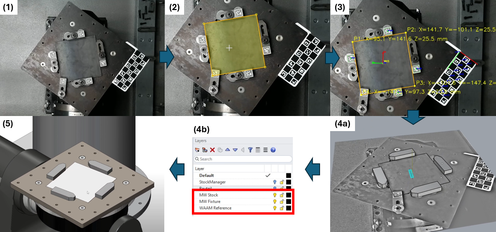

# Kameragestützte Erkennung der Aufspannsituation für WAAM-Substratplatten

[English](README.md) | **Deutsch**

[](https://doi.org/10.5281/zenodo.21441378)

Forschungsprototyp zur kameragestützten Unterstützung des Rüstprozesses einer Wire-Arc-Additive-Manufacturing-Zelle (WAAM). Die Software bestimmt eine nutzbare Fläche auf der Substratplatte in Werkobjektkoordinaten, erkennt markierte Spanneisen und übergibt die erzeugten Geometrien an Rhino für die CAD/CAM-Planung.

> **Projektstatus:** Der assistierte Workflow ist der empfohlene und validierte Betriebsmodus. Die automatische kantenbasierte Konturerkennung ist als experimenteller Entwicklungspfad enthalten und für einen uneingeschränkt robusten Einsatz nicht ausreichend.

<p align="center">
  
</p>

## Zielsetzung

Das System unterstützt einen Rüstprozess, bei dem Substratplatten und Spanneisen variabel auf einer Aufspannplatte angeordnet werden. Eine Monokamera erfasst die Szene. ChArUco- und ArUco-Fiducials stellen den geometrischen Bezug her, der für die Transformation von Bildpunkten in das Werkobjektkoordinatensystem erforderlich ist.

Der Softwarestand umfasst:

* intrinsische Kamerakalibrierung über das integrierte Kalibrierfenster;
* ChArUco-basierte Bestimmung der Kamerapose;
* Transformation von Bildkoordinaten in ein ebenes Werkobjektkoordinatensystem;
* assistierte Polygondefinition der nutzbaren Schweißfläche;
* experimentelle automatische Konturerkennung mit Canny-Kanten und probabilistischer Hough-Transformation;
* Erkennung und Orientierungsbestimmung ArUco-markierter Spanneisen;
* JSON-Export und Erzeugung der CAD-Geometrien in Rhino;
* Erzeugung eines entzerrten Referenzbilds zur visuellen Kontrolle im CAD.

## Getestete Umgebung und Voraussetzungen

Die Implementierung ist für Windows ausgelegt, da die Kameraerkennung und -aufnahme DirectShow beziehungsweise Media Foundation sowie `pygrabber` verwenden.

Erforderlich sind:

* eine 64-Bit-CPython-Installation, die mit den in `requirements.txt` angegebenen Paketversionen kompatibel ist;
* eine über OpenCV erreichbare Kamera;
* das gedruckte ChArUco-Referenzboard und die ArUco-Marker der Spanneisen mit den im Quellcode hinterlegten Abmessungen;
* Rhino 8 für den integrierten CAD-Import;
* das jeweilige CAM-Plug-in nur dann, wenn dessen Layerkonventionen und Maschinensimulation genutzt werden.

Rhino, ModuleWorks und weitere kommerzielle CAM-Komponenten sind nicht Bestandteil dieses Repositoriums.

## Installation

Repository klonen und Installationsskript ausführen:

```bat
git clone https://github.com/Coder861/waam-fixture-recognition.git
cd waam-fixture-recognition
install_requirements.bat
```

Das Skript erstellt die lokale virtuelle Umgebung `.venv` und installiert die externen Python-Abhängigkeiten.

Manuelle Installation:

```bat
python -m venv .venv
.venv\Scripts\python.exe -m pip install --upgrade pip
.venv\Scripts\python.exe -m pip install -r requirements.txt
```

## Programmstart

### Eigenständiger Vision-Workflow

```bat
.venv\Scripts\python.exe mainGUI.py
```

### In Rhino integrierter Workflow

`rhinoWAAMContour.py` im Rhino ScriptEditor öffnen oder folgenden Befehl einer Rhino-Schaltfläche beziehungsweise einem Alias zuweisen:

```text
! _-ScriptEditor _Run "C:\path\to\waam-fixture-recognition\rhinoWAAMContour.py"
```

Das Rhino-Skript startet die externe Vision-GUI mit der lokalen virtuellen Umgebung. Nach dem Export liest Rhino die Datei `data.json` ein und erzeugt die Geometrien der Substratplatte und der erkannten Spanneisen.

## Bedienablauf

1. Kamera im Hauptfenster auswählen.
2. Prüfen, ob für Kamera und Auflösung eine passende intrinsische Kalibrierdatei erkannt wird.
3. Falls keine geeignete Kalibrierung vorliegt, die integrierte Kamerakalibrierung starten, die erforderlichen ChArUco-Aufnahmen erfassen, den Reprojektionsfehler prüfen und das Ergebnis speichern.
4. Kamera aktualisieren oder erneut auswählen, falls die neu gespeicherte Kalibrierung nicht unmittelbar erkannt wird.
5. Aktuelle Aufspannsituation aufnehmen.
6. Den **assistierten Modus** wählen und das Polygon der nutzbaren Schweißfläche markieren. Der automatische Modus dient Versuchen unter den untersuchten Bildbedingungen.
7. Dicke der Substratplatte eingeben.
8. Erkannte Koordinatenachsen, Polygonpunkte und Spanneisenmarker prüfen.
9. **Kontur → CAD** wählen, um die JSON-Daten zu schreiben und den Rhino-Import fortzusetzen.

## Kalibrierung und geometrische Referenzierung

Die aktuelle Implementierung verwendet zwei unterschiedliche ChArUco-Boards, die nicht verwechselt werden dürfen:

| Zweck                             | Felder | Feldlänge | Markerlänge | Dictionary    |
| --------------------------------- | -----: | --------: | ----------: | ------------- |
| Intrinsische Kamerakalibrierung   |  9 × 6 |     15 mm |       11 mm | `DICT_4X4_50` |
| Szenenpose und Werkebenenreferenz |  3 × 8 |     30 mm |     22,5 mm | `DICT_4X4_50` |

Die intrinsische Kalibrierung ist in die GUI integriert und gilt nur für die jeweilige Kamera, Auflösung, Fokuseinstellung und optische Anordnung.

Die Beziehung zwischen ChArUco- und Werkobjektkoordinatensystem ist anlagenspezifisch. Die in `visionPipeline.py` hinterlegten Werte beschreiben die untersuchte WAAM-Zelle. `coordinate_calibration.py` bestimmt aus korrespondierenden Soll- und Istpunkten eine ebene Korrektur und dient der erstmaligen Referenzierung einer anderen Anlage oder der erneuten Referenzierung nach einer relevanten mechanischen Änderung.

Die beigefügte `.npz`-Datei dokumentiert die untersuchte EMEET-SmartCam-Nova-4K-Konfiguration. Sie ist keine allgemeingültige Kalibrierdatei und darf nicht ungeprüft für eine andere Kamera, Auflösung, Fokuseinstellung oder Montageposition verwendet werden.

## Ausgabedaten

Die Vision-Anwendung erzeugt:

* `data.json`: Geometrie- und Metadaten für die Übergabe an Rhino;
* `spannsituation_ortho.png`: entzerrtes Referenzbild der Werkebene.

Das aktuelle JSON-Format verwendet Meter als geometrische Einheit und enthält:

* den gewählten Pipeline-Modus;
* Substratplattendicke und Höhe der Schweißebene;
* ArUco-ID, Position und Orientierung jedes erkannten Spanneisens;
* Polygonpunkte der nutzbaren Schweißfläche;
* Platzierungsdaten des entzerrten Referenzbilds.

Ein Beispiel im aktuellen Format befindet sich unter `examples/example_output.json`.

## Aufbau des Repositoriums

| Datei oder Verzeichnis      | Aufgabe                                                                           |
| --------------------------- | --------------------------------------------------------------------------------- |
| `mainGUI.py`                | Hauptoberfläche, Kameraauswahl, Bildaufnahme und assistierte Polygonerfassung     |
| `cameraCalibration.py`      | Integrierte intrinsische ChArUco-Kamerakalibrierung                               |
| `visionPipeline.py`         | Posenschätzung, Transformationen, Marker-Erkennung, Masken und Konturverarbeitung |
| `coordinate_calibration.py` | Erstmalige ebene Korrektur der Werkobjektreferenz                                 |
| `rhinoWAAMContour.py`       | Startet die externe GUI und erzeugt Rhino-Geometrien aus dem JSON-Ergebnis        |
| `requirements.txt`          | Externe Python-Abhängigkeiten                                                     |
| `install_requirements.bat`  | Einrichtung und Installation der lokalen virtuellen Umgebung                      |
| `icons/`                    | Für den GUI-Start erforderliche Symbole                                           |
| `media/`                    | Medien der README einschließlich der Prozessabbildung                             |
| `examples/`                 | Kleine Beispieldaten ohne vertrauliche Produktionsinformationen                   |

## Bekannte Grenzen

* Die automatische Konturpipeline ist auf die untersuchte 4K-Anordnung parametriert und bleibt experimentell.
* Im assistierten Modus muss der Bediener ein gültiges, nicht selbstschneidendes Polygon definieren.
* Die ebene Transformation setzt voraus, dass die ausgewählte Kontur auf der eingegebenen Substratoberfläche liegt.
* Die Spanneisengeometrien werden aus Markerpositionen und einer Lookup-Tabelle rekonstruiert. Markerposition, Markerhöhe, Spanneisenabmessungen und ID-Zuordnung müssen mit der Implementierung übereinstimmen.
* Unbekannte oder falsch zugeordnete Marker-IDs können fehlerhafte Störgeometrien erzeugen und müssen vor der Verwendung abgefangen oder geprüft werden.
* Die Werkobjektoffsets im Quellcode sind spezifisch für die untersuchte Zelle.
* Unterstützte Kameraparameter hängen vom jeweiligen Treiber ab.
* Die Software wurde nicht als Sicherheitskomponente entwickelt oder zertifiziert.

## Sicherheitshinweis

Das Repository enthält einen Forschungsprototyp. Erzeugte Koordinaten und CAD-Objekte müssen vor CAM-Programmierung, Roboterbewegung, Schweißen oder Kollisionsbewertung geprüft werden. Die Software ersetzt weder die Maschinensicherheit noch validierte Roboterprogramme, Prozessaufsicht oder ein sicherheitsgerichtetes Kollisionsvermeidungssystem.

## Zitierung

Die Zitationsmetadaten befinden sich in `CITATION.cff`. Eine Zenodo-DOI wird nach Veröffentlichung des ersten archivierten GitHub-Releases ergänzt.

Die zugehörige Bachelorarbeit erhält später eine separate institutionelle URN. Diese kann anschließend unter „Zugehörige Bachelorarbeit“ ergänzt werden; sie ersetzt nicht die DOI des Softwarestands.

## Lizenz

Die Software wird unter der GNU General Public License v3.0 veröffentlicht. Siehe [LICENSE](LICENSE).
